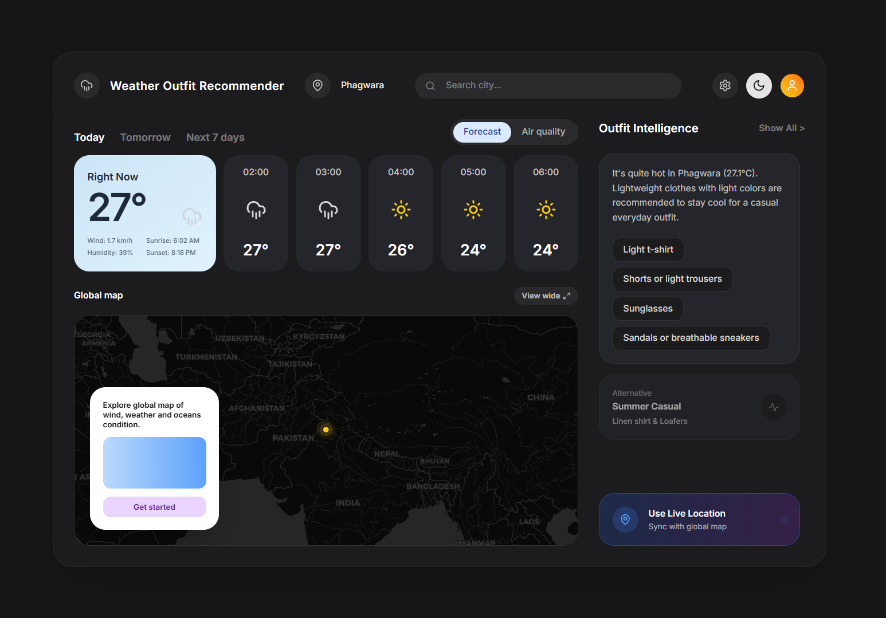
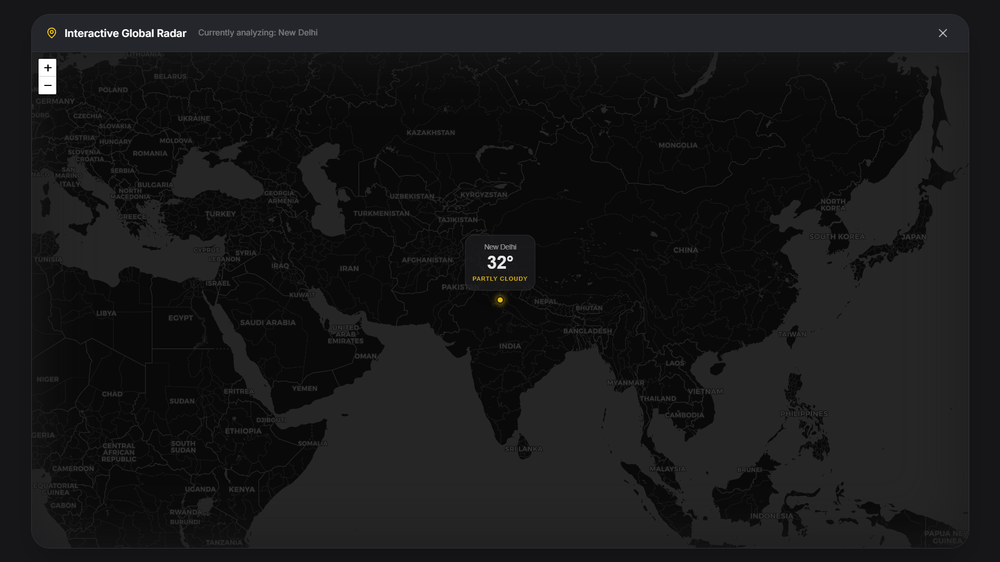
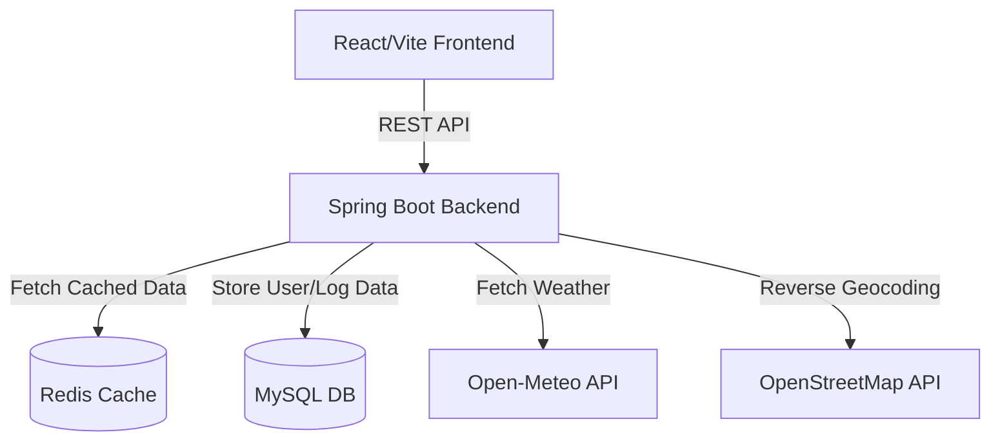

<div align="center">

# ☁️ Weather Outfit Recommendation Platform

A sophisticated, full-stack web application that combines real-time meteorological data with intelligent outfit curation. Designed with a premium, developer-centric UI featuring cinematic boot sequences and an interactive global radar.

[](https://spring.io/projects/spring-boot)
[](https://reactjs.org/)
[](https://www.docker.com/)
[](https://redis.io/)

</div>

---

## 📸 Screenshots

| Dashboard Overview | Interactive Map Modal | Recommendative Search |
|:---:|:---:|:---:|
|  |  |  |

## ✨ Features

- **Intelligent Outfit Engine:** Dynamically curates clothing recommendations based on real-time temperature, wind, and atmospheric conditions. Includes dynamic fallback "Alternative" outfits for extreme climates.
- **Cinematic Bootloader:** Features a high-fidelity, Docker-inspired ASCII terminal boot sequence that seamlessly transitions into the main dashboard.
- **Interactive Global Radar:** An integrated Leaflet-based map that allows you to click, drag, and explore weather conditions globally. Features a stunning dark-mode tile layer with full city labels.
- **Live Geolocation:** Instantly syncs the map and recommendations to your current coordinates using browser APIs and OpenStreetMap Reverse Geocoding.
- **Smart Autocomplete Search:** Fast, real-time city lookup utilizing the Open-Meteo Geocoding API.
- **Robust Caching:** Utilizes Redis to heavily cache weather forecasts and geocoding results to minimize external API rate limits and drastically improve load times.

## 🏗 Architecture

The platform is built using a modern, decoupled microservices architecture, entirely orchestrated via Docker Compose for zero-configuration deployment.



## 🛠 Tech Stack

### Frontend
- **React.js (Vite)**
- **TailwindCSS** (Customized Dark Mode UI, Glassmorphism, Micro-animations)
- **Framer Motion** (Cinematic transitions and state animations)
- **React-Leaflet** (Interactive mapping)
- **Axios** (API communication)

### Backend
- **Java 17 / Spring Boot**
- **Spring Data JPA & Hibernate**
- **Spring Boot Cache**

### Infrastructure
- **MySQL 8.0**
- **Redis Alpine**
- **Docker & Docker Compose**

## 🚀 Getting Started

Deploying the entire stack locally is incredibly simple. You only need Docker installed on your machine.

### Prerequisites
- [Docker Desktop](https://www.docker.com/products/docker-desktop/) installed and running.

### 1-Click Deployment

1. Clone the repository:
   ```bash
   git clone https://github.com/yourusername/weather-outfit-platform.git
   cd weather-outfit-platform
   ```

2. Boot the infrastructure using Docker Compose:
   ```bash
   docker compose up --build -d
   ```

3. Access the platform:
   - **Frontend UI:** Open your browser and navigate to `http://localhost:3000`
   - **Backend API:** Available at `http://localhost:8080`

*Note: The initial boot sequence in the frontend UI mimics the actual Docker engine startup. The backend Spring Boot container typically takes ~5-10 seconds to fully initialize the database connections.*

## 🤝 Contributing

Contributions, issues, and feature requests are welcome! Feel free to check the [issues page](https://github.com/yourusername/weather-outfit-platform/issues).

## 📄 License

This project is open-source and available under the [MIT License](LICENSE).
